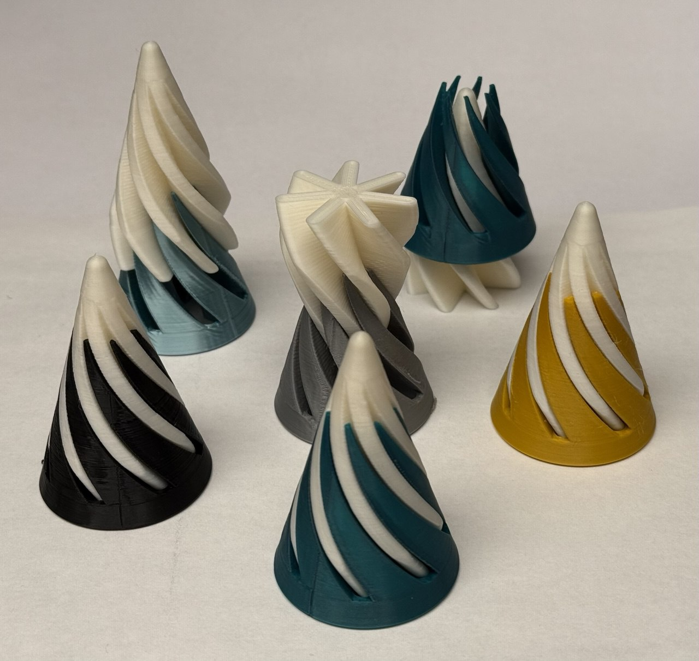

# Spiral Toy

Two parts of the spiral with an overall conic shape. 
You can customize all parameters via [SpiralToy.scad](SpiralToy.scad) file.

Rendered files:

* Inner part: [SpiralToy_v2_InnerPart.stl](SpiralToy_v2_InnerPart.stl)
* Outer part: [SpiralToy_v2_OuterPart.stl](SpiralToy_v2_OuterPart.stl)

